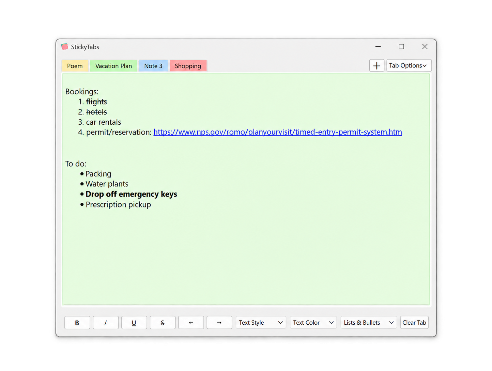
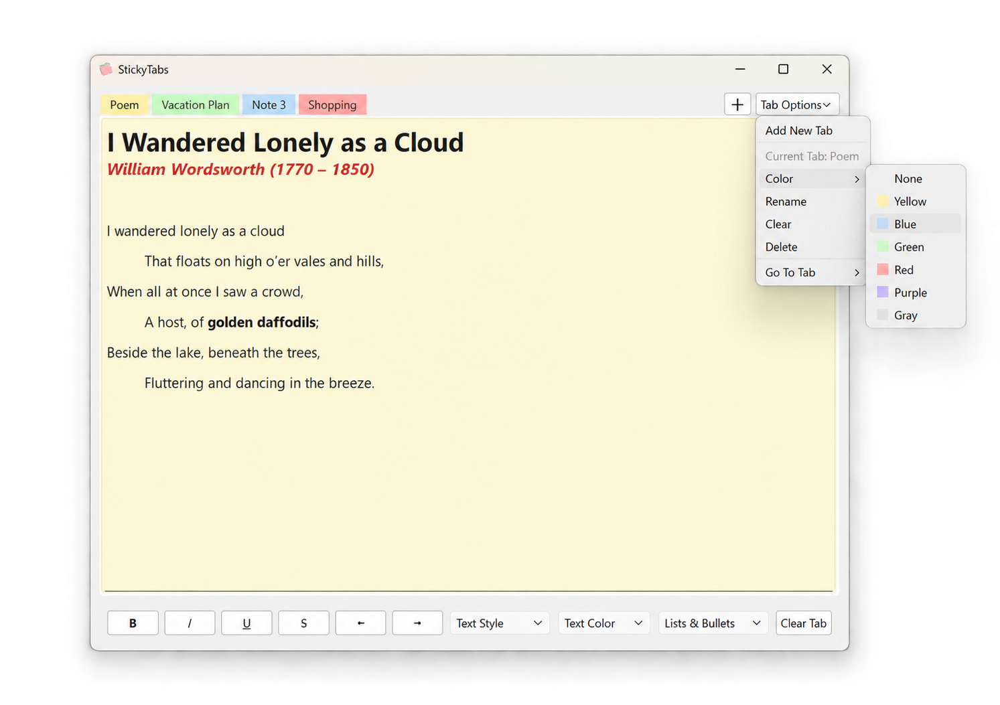
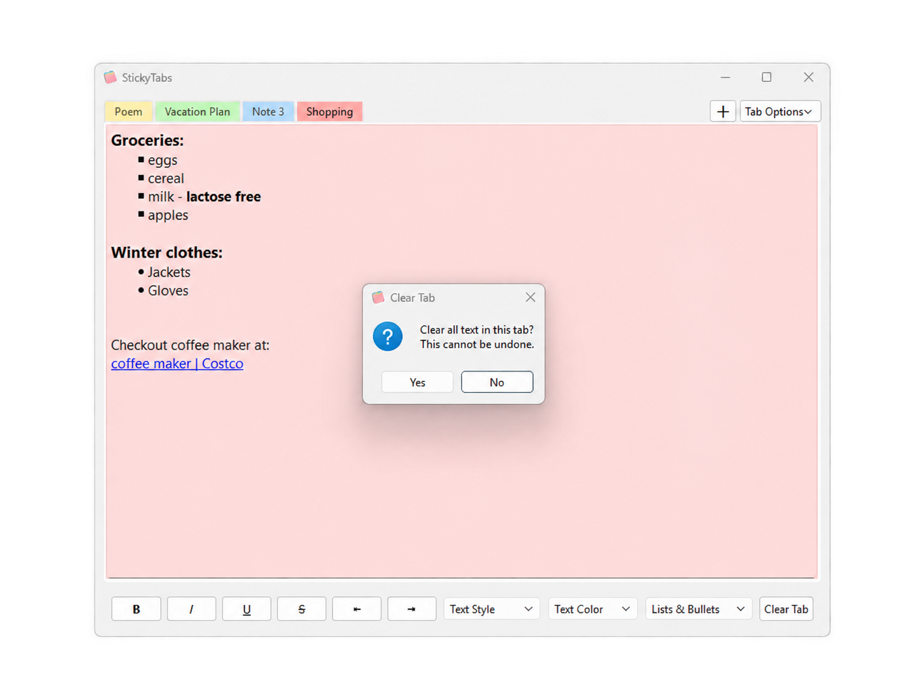

# StickyTabs

StickyTabs is a lightweight desktop note-taking application built with Python and PySide6. It provides a tabbed workspace for organizing short notes, lists, links, and formatted text in a simple sticky-note-inspired interface.

The project was built as a standalone desktop application with persistent local storage, rich-text editing, tab customization, hyperlink support, and PyInstaller packaging for a standalone Windows executable.

## Download

A standalone Windows executable is available from the latest GitHub release.

[Download StickyTabs for Windows](https://github.com/JahangirE/StickyTabs/releases/latest)

No Python installation is required.

## Features

- Create, rename, reorder, navigate, and delete multiple note tabs
- Assign individual colors to tabs with matching note backgrounds
- Rich-text formatting:
  - Bold
  - Italic
  - Underline
  - Strikethrough
  - Title, heading, subheading, and body styles
  - Text colors
- Bulleted and numbered lists
- Paragraph indentation and outdentation
- Paste and preserve hyperlinks from rich-text sources
- Open links with `Ctrl + Click`
- Automatic local saving and restoration between sessions
- Preserve rich-text formatting, hyperlinks, tab names, colors, and the active tab
- Confirmation dialogs before destructive actions such as clearing or deleting content
- Recovery protection for invalid or corrupted save files
- PyInstaller configuration for a single-file Windows executable with a custom application icon

## Screenshots

### Note-taking and lists

Multiple colored tabs can be used for different types of notes. StickyTabs supports numbered lists, bullet lists, formatted text, and clickable hyperlinks.



### Text formatting and tab customization

Notes support text hierarchy, emphasis, indentation, and per-tab color customization.



### Clear-tab confirmation

StickyTabs asks for confirmation before clearing an entire note to help prevent accidental data loss.



## Technology

- Python
- PySide6 / Qt
- JSON
- PyInstaller

## Project Structure

```text
StickyTabs/
├── assets/
│   ├── stickytabs_icon.ico
│   └── stickytabs_icon.png
├── screenshots/
│   ├── stickytabs_main.png
│   ├── stickytabs_tab_colors.png
│   └── stickytabs_clear_confirmation.png
├── app.py
├── main.py
├── storage.py
├── widgets.py
├── requirements.txt
├── StickyTabs.spec
├── .gitignore
└── README.md
```

### `main.py`

Application entry point. Creates the Qt application, loads the application icon, launches the main window, and starts the event loop.

### `app.py`

Contains the main StickyTabs interface and application behavior, including tab management, formatting controls, note editing, autosave integration, and user dialogs.

### `widgets.py`

Contains custom Qt widgets and shared UI definitions, including:

- the custom colored tab bar
- hyperlink-aware text editor
- tab, note, and text color palettes
- reusable color-swatch icons

### `storage.py`

Handles local persistence independently of the Qt interface. Notes are serialized to JSON and written using a temporary-file-then-replace strategy to reduce the risk of corrupting an existing save.

Invalid JSON save files are preserved rather than immediately overwritten.

## Running from Source

### Requirements

- Python 3.11 (tested)
- PySide6

Clone the repository and create a virtual environment:

```bash
python -m venv .venv
```

Activate it on Windows:

```powershell
.venv\Scripts\activate
```

Install the dependency:

```powershell
python -m pip install -r requirements.txt
```

Run StickyTabs:

```powershell
python main.py
```

## Local Data Storage

StickyTabs stores user notes outside the project directory so application data is kept separate from the source code.

On Windows:

```text
%APPDATA%\StickyTabs\notes_data.json
```

This typically resolves to:

```text
C:\Users\<username>\AppData\Roaming\StickyTabs\notes_data.json
```

The source code also defines platform-specific user-data locations for macOS and Linux; the packaged application has currently been tested on Windows.

## Building the Windows Application

The repository includes `StickyTabs.spec`, which contains the PyInstaller configuration for the packaged application.

Install PyInstaller in the development environment:

```powershell
python -m pip install pyinstaller
```

Then build the application with:

```powershell
python -m PyInstaller --clean --noconfirm StickyTabs.spec
```

The resulting executable is created under:

```text
dist\StickyTabs.exe
```

The packaged Windows application is built as a single-file, windowed executable and does not require Python or PySide6 to be installed on the end user's machine.

## Design Notes

StickyTabs separates interface logic, custom widgets, persistence, and application startup into small modules rather than placing the entire application in a single script.

The persistence layer has no Qt dependency, while reusable interface behavior such as hyperlink handling and colored tab rendering is implemented through dedicated Qt subclasses.

## Current Status

The Windows packaged build has been tested independently of the development environment, including:

- launching outside the project directory
- loading existing notes
- saving changes
- restoring notes after restart
- rich-text persistence
- hyperlink behavior
- corrupted-save-file recovery
- custom application icon

## Possible Future Enhancements

Potential future improvements include:

- additional note organization options
- user-configurable preferences
- search across notes
- export/import functionality
- keyboard shortcuts
- additional platform packaging


